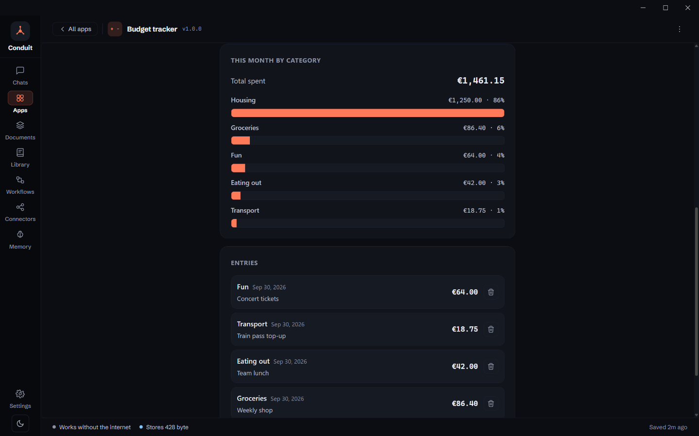

<!-- i18n-source: 2b7a5e1 -->

<!-- i18n-nav:start -->
<!-- Generated by scripts/readme-i18n.mjs — do not edit by hand. -->

[English](./README.md) &nbsp;·&nbsp; [Deutsch](./README.de.md) &nbsp;·&nbsp; **Español** &nbsp;·&nbsp; [Français](./README.fr.md) &nbsp;·&nbsp; [日本語](./README.ja.md) &nbsp;·&nbsp; [한국어](./README.ko.md) &nbsp;·&nbsp; [Português (Brasil)](./README.pt-BR.md) &nbsp;·&nbsp; [简体中文](./README.zh-CN.md)

<!-- i18n-nav:end -->

# Conduit

**Un asistente de IA de escritorio que funciona primero en local. Tus conversaciones se quedan en tu equipo.**

[conduitllm.com](https://conduitllm.com/es)

[](https://github.com/runningpixels/conduit/actions/workflows/ci.yml)
[](./LICENSE)


Conduit es un cliente de chat de escritorio para grandes modelos de lenguaje,
construido sobre Tauri 2 con un núcleo en Rust y un renderizador en React. Tú
aportas tu propia clave de API, hablas con cualquiera de diecisiete
proveedores, y todo — conversaciones, adjuntos, artefactos — se almacena
localmente en una base de datos SQLite en tu propio disco, con cifrado en
reposo opcional. No hay cuenta de Conduit, ni backend, ni telemetría.

Las páginas que construye el asistente se pueden conservar como **apps** que
abres desde la barra de navegación, y los **flujos de trabajo** ejecutan
rutinas por ti según un horario.

## Por qué Conduit

- **El renderizador nunca ve tu clave de API.** Las credenciales viven en el
  llavero del sistema operativo; los ajustes solo guardan una referencia
  `keychain://conduit/<provider>`. Todas las llamadas de red ocurren en Rust.
  Lo garantiza la arquitectura, no una política — véase
  [`docs/architecture/foundation-contracts.md`](./docs/architecture/foundation-contracts.md).
- **Cifrado en reposo opcional.** AES-256-GCM sobre los blobs de adjuntos y
  artefactos y varias columnas de la base de datos, con una clave maestra
  envuelta en el llavero del sistema. Está **desactivado de forma
  predeterminada** (`AppSettings.encryption_at_rest`) y todavía no cubre el
  contenido de los mensajes. El cifrado nunca se degrada en silencio: si la
  clave no está disponible y existen datos cifrados, la aplicación se niega a
  arrancar en lugar de recurrir al texto plano.
- **Trae tu propio proveedor.** Anthropic, OpenAI, Gemini, OpenRouter, OpenCode
  Zen, Groq, DeepSeek, Mistral, xAI, Z.ai, Moonshot AI, Qwen, Together AI,
  Fireworks AI, LM Studio, Ollama y cualquier endpoint compatible con OpenAI.
- **Conectores MCP con una verdadera barrera de consentimiento.** Los servidores
  del Model Context Protocol locales por stdio y remotos por HTTP en streaming
  se ejecutan bajo un supervisor con reintento escalonado, un límite de
  concurrencia y tiempos de espera por llamada. Las herramientas con efectos
  secundarios piden permiso antes de ejecutarse, su salida se censura y se limita
  en tamaño, y nunca se reinyecta en el prompt.
- **Artefactos que no pueden llamar a casa sin tu permiso.** El HTML generado
  por el modelo se renderiza en un iframe aislado de origen nulo bajo una CSP
  estricta con `connect-src 'none'`, sin forma de llamar a los comandos de la
  propia aplicación. Una página que necesita datos en vivo pregunta, sitio por
  sitio, antes de que Conduit los obtenga en su nombre — solo https, sin
  cookies ni credenciales, nunca tu red local, y nunca en modo solo local. Una
  página que quiere usar tu modelo de IA también pregunta, y recibe texto de
  entrada y texto de salida: sin herramientas, historial de chat, memoria ni
  documentos. El texto, el código, el JSON y el
  Markdown pasan por renderizadores con escape de React, sin
  `dangerouslySetInnerHTML` en ningún punto de la ruta segura.
- **Sin telemetría.** La comprobación de actualizaciones es opcional y solo envía
  `Conduit-Updater/<version>`. Por defecto la comprobación es manual; la
  comprobación en segundo plano y la instalación al cerrar son opcionales, y
  Conduit nunca se reinicia solo.

## Funciones

### Tus documentos, con búsqueda desde un chat

**Documentos** en la barra de navegación contiene colecciones de tus propios
archivos — texto plano, Markdown, CSV, Word y PDF —, o puedes arrastrar
archivos a cualquier parte de la ventana. Adjunta una colección desde el
campo de mensaje y el asistente la consulta mientras responde; cada
documento que ha usado aparece nombrado debajo de la respuesta, y al hacer
clic en uno se muestra el pasaje exacto. La recuperación es híbrida: búsqueda
semántica para pasajes con el mismo significado y búsqueda por palabra clave
para términos exactos como códigos de error y nombres.

Los PDF se leen en tu equipo. Al indexar, el texto de un documento se envía
al proveedor que incrusta la colección, así que se te pregunta antes de que
el primer documento vaya a cada proveedor, y puedes retirar ese
consentimiento en cualquier momento. Con el modo solo local activado, una
colección necesita un proveedor local como Ollama. Hasta que crees una
colección, nada cambia en el chat.

### Generación de imágenes

En OpenAI, Gemini y OpenRouter, pide una imagen — «dibújame un logotipo
sencillo para una panadería» — y la obtienes, guardada con el chat y
mostrada en el panel de artefactos. Las imágenes se
almacenan localmente, no enlazadas desde el proveedor, así que no
desaparecen cuando caduca una URL remota. Cada imagen se factura, así que
Conduit pregunta una vez antes de generar la primera.

### Artefactos

El código, el HTML, el JSON y el Markdown generados por el modelo se abren en un
panel lateral con vistas de previsualización y de código fuente. El HTML se
renderiza en un iframe aislado de origen nulo con `connect-src 'none'`: no puede
alcanzar la red ni el puente de Tauri por sí solo. Una página que llama a
`fetch()`, como un panel meteorológico, muestra un aviso con el nombre del
sitio; el cuadro de diálogo indica por qué la página lo quiere y qué envía, y
tú eliges permitirlo esta vez, permitirlo siempre para esa página, o no
permitirlo. El globo en la cabecera del panel muestra todos los sitios y
solicitudes. Configuración → Seguridad de los artefactos lo desactiva y
muestra los permisos recordados.

Puedes ver cómo se escribe un documento, con una vista previa en vivo
opcional. Los documentos demasiado largos para una sola respuesta se
construyen sección por sección, y si un turno se queda sin tiempo, conserva
lo que ha escrito y ofrece **Seguir construyendo**. Las revisiones cambian
solo la parte que difiere. El panel se puede expandir (`Ctrl+Shift+E`) para
ocupar todo menos una columna estrecha de chat.

### Apps

Una buena página no debería desaparecer cuando su chat se desplaza fuera de
vista. **Guardar como app** (en el menú ⋯ de la página) conserva una copia que
abres desde **Apps** en la barra de navegación, o desde **Tus apps** en la
pantalla de chat nuevo — y sigue funcionando después de que borres el chat. Al
guardar se te pregunta, una por una, cuáles de las autorizaciones de sitio de
la página conservar; ninguna se mantiene a menos que la marques.


Vienen ocho **apps iniciales** incluidas — un temporizador Pomodoro, un
conversor de unidades, Snake, un juego de memoria, un cuestionario de
capitales del mundo, un control de presupuesto, y un panel meteorológico y un
conversor de divisas que usan datos en vivo. Las ideas de la pantalla de chat
nuevo que tienen una muestran **Abrir app**.

Las apps (y las páginas de un chat) pueden hacer tres cosas que una página web
normal en un entorno aislado no puede, cada una declarada por la página y
comprobada por Conduit:

- **Conservar datos entre ejecuciones** — un pequeño almacén por app (hasta
  5 MB), guardado junto con el resto de tus datos y cifrado cuando el cifrado
  en reposo está activado. La línea de estado de la app muestra cuánto
  conserva, y Borrar datos está a un clic.
- **Admitir ajustes** — una página declara unas pocas entradas, como una
  ciudad y las unidades, y Conduit dibuja el formulario. Cambiarlas actualiza
  la app en ejecución sin recargarla.
- **Consultar tu modelo de IA** — después de que lo permitas para esa página.
  El aviso nombra al proveedor y dice con claridad cuándo el texto saldría de
  tu dispositivo; la página recibe una respuesta y nada más.




### Flujos de trabajo

Los **flujos de trabajo** ejecutan rutinas por ti: obtener páginas, buscar en
la web, pedir al modelo que resuma y guardar el resultado como documento.
Empieza con uno ya preparado — un resumen matinal, un resumen de página, un
seguimiento de tema — o crea el tuyo paso a paso, y luego ejecútalo ahora o
según un horario. Al activar un horario por primera vez se muestra todo lo que
el flujo podrá hacer por su cuenta, para que lo apruebes, y una ejecución que
necesita más se detiene y pregunta.


### Conectores MCP

Los servidores MCP locales por stdio y remotos por HTTP en streaming se ejecutan
bajo un supervisor. Las llamadas a herramientas se muestran en línea, los
resultados se censuran y se limitan en tamaño, y las herramientas con efectos
secundarios piden consentimiento antes de ejecutarse.

Los prompts y recursos de un servidor también son accesibles desde el campo
de mensaje, no solo sus herramientas. El selector de prompts rellena los
argumentos que declara un prompt y coloca el resultado en el campo de
mensaje para que lo edites; el selector de recursos adjunta un documento al
siguiente mensaje, que se revisa antes de llegar al modelo.

### Apariencia

Un diseño con dos modos: oscuro, claro o según el sistema. El color
principal —el acento de los botones, la selección y el elemento activo— se
elige por separado para cada modo en Ajustes → Apariencia; se rechaza un
color que sería difícil de leer.


### Ocho idiomas

La interfaz está disponible en inglés, alemán, español, francés, japonés,
coreano, portugués de Brasil y chino simplificado. El idioma que elijas
también determina el idioma en el que responde el asistente, y las fechas,
los números y los tamaños de archivo siguen ese idioma en vez de la región
del equipo.

### Y más

- **Seis proveedores más** en rc.5 — xAI, Z.ai, Moonshot AI, Qwen, Together AI
  y Fireworks AI —, cada uno con un campo de URL base para endpoints
  regionales o autoalojados. Anthropic y OpenAI también tienen uno, así que
  cualquiera de los dos puede apuntar a un endpoint compatible o a un proxy
  LiteLLM.
- **La configuración inicial** empieza con el idioma, el tema y el tamaño de
  texto, cubre el modo solo local, el almacenamiento de claves, las
  comprobaciones de actualizaciones y el diagnóstico, y termina con un
  resumen de lo configurado.
- **Una barra de navegación** — Chats, Apps, Documentos, Biblioteca (prompts
  y skills), Flujos de trabajo, Conectores, Memoria y Configuración — para
  que cada función tenga un solo lugar.
- **Ideas en la pantalla de chat nuevo** — cosas que probar, por categoría,
  que rellenan el prompt por ti; tus apps más recientes aparecen encima.
- **Un inspector** junto al chat con la Página, la Actividad del turno (cada
  llamada a herramienta, búsqueda y sitio, con tiempos) y sus Fuentes; el
  chat en sí muestra una línea por turno en vez de tarjetas de herramientas.
- **Un único «+» en el campo de mensaje** para adjuntos, búsqueda web, la
  carpeta del espacio de trabajo, documentos, skills y prompts de conector,
  con lo que está activo mostrado como chips; la lista de chats indica qué
  chat está en curso o te necesita.
- **Búsqueda en Configuración** y una hoja de atajos de teclado (`Ctrl+/`,
  `⌘/` en macOS).
- **Una barra lateral redimensionable**, un menú ⋯ en cada conversación
  (renombrar, fijar, archivar, mover) y overlays para la barra lateral y el
  inspector en ventanas estrechas.

Consulta [`CHANGELOG.md`](./CHANGELOG.md) para ver todo lo incluido en cada versión.

## Estado

**v1.0.0-rc.1 — versión candidata.** Los instaladores para Windows, macOS
(Apple silicon e Intel) y Linux están en la
[página de versiones](https://github.com/runningpixels/conduit/releases). No
están firmados por el sistema operativo, así que el primer arranque muestra un
aviso de Gatekeeper o SmartScreen. Compilar desde el código fuente también
funciona.

Es la versión candidata de la 1.0: todo lo que figura abajo funciona, y lo que
falta es comprobarlo en instalaciones reales antes de darla por final.

> La matriz completa de funcionalidades se mantiene solo en el
> [README en inglés](./README.md#status), para que no quede obsoleta en ocho
> idiomas a la vez. Lo que incluye cada versión está en
> [`CHANGELOG.md`](./CHANGELOG.md).

### Problemas conocidos

- **macOS y Linux: una página puede abrir una conexión WebRTC.** La política de
  seguridad de contenido de una página no cubre WebRTC, así que en macOS y
  Linux el script de una página podría llegar a un host mediante STUN/TURN
  incluso sin permiso de red. En Windows esto se bloquea en el propio webview;
  las correcciones para macOS y Linux todavía no se han construido ni
  verificado. Hasta entonces, abre con cuidado en esos sistemas las páginas
  HTML y las apps que te haya dado otra persona.

## Compilar desde el código fuente

### Requisitos previos

- **Node 22+** y **pnpm 10.34.4** (`corepack enable && corepack prepare pnpm@10.34.4 --activate`)
- **Rust stable** ([rustup](https://rustup.rs)) — `rust-toolchain.toml` fija el canal
- Cadena de herramientas por plataforma:
  - **Windows** — Visual Studio 2022 Build Tools con la carga de trabajo de C++.
    Ejecuta `./check-setup.ps1` para verificarlo.
  - **macOS** — Xcode Command Line Tools (`xcode-select --install`), macOS 11+.
  - **Linux** —
    ```bash
    sudo apt-get install -y libwebkit2gtk-4.1-dev libgtk-3-dev \
      libayatana-appindicator3-dev librsvg2-dev patchelf build-essential libssl-dev
    ```

### Compilar y ejecutar

```bash
git clone https://github.com/runningpixels/conduit
cd conduit
pnpm install
pnpm dev          # Vite en :5173, después el shell de Tauri
```

`pnpm build` produce un paquete de versión. En el primer arranque, la
configuración inicial pide una clave de proveedor (o apúntala a una instancia
local de Ollama, que no necesita clave).

### Comprobaciones

```bash
cargo fmt --all --check
cargo clippy --workspace --all-targets -- -D warnings
cargo test --workspace                 # pruebas unitarias y de integración de Rust
pnpm -C packages/config-schema check   # barrera de deriva del esquema
pnpm -C apps/desktop check             # tsc -b
pnpm -C apps/desktop test              # pruebas del renderizador
```

## Dónde viven tus datos

Todo está bajo un único directorio por usuario que resuelve
`directories::ProjectDirs`:

| Plataforma | Ruta |
|---|---|
| Windows | `%LOCALAPPDATA%\Conduit\Conduit\data` |
| macOS | `~/Library/Application Support/com.Conduit.Conduit` |
| Linux | `~/.local/share/conduit` |

Contiene `settings.json`, `conduit.sqlite` y las carpetas `attachments/`,
`artifacts/`, `exports/`, `logs/`, `diagnostics/`, `updates/` y `streams/`. Las
claves de API **no** están ahí: están en el llavero del sistema operativo.
Borrar ese directorio restablece la aplicación por completo.

## Arquitectura

Un monorepo políglota: un workspace de Cargo y un workspace de pnpm que
comparten una misma raíz.

```text
apps/desktop/            Tauri app — src/ (React renderer) + src-tauri/ (Rust backend)
crates/provider-core/    Provider-agnostic LLM abstraction, adapters, the trust boundary
crates/mcp-runtime/      MCP transport + protocol core (stdio and streamable HTTP)
packages/config-schema/  Generated TS mirror of the Rust schema (@conduit/config-schema)
packages/ui/             Design tokens, primitives, bundled fonts (@conduit/ui)
```

La invariante que sigue todo lo demás: **el renderizador presenta estado e
intención únicamente; Rust posee los secretos, la persistencia y las operaciones
privilegiadas.** Un turno de chat:

```text
React ChatView
  └─ ipc/client.startChatStream(ProviderRequest, onEvent)
       └─ Tauri invoke('start_chat_stream', { request, channel })   ← per-request Channel
            └─ StreamManager
                 ├─ provider_core::get_adapter(active_provider)
                 ├─ build_adapter_context   (key from keychain, base URL from settings)
                 ├─ adapter.stream_chat(request, ctx, CancellationToken)
                 └─ per ProviderEvent: append to the event log (one txn) → channel.send
  Renderer: streamState.ts folds ProviderEvents into AssistantStreamState and renders it
```

La persistencia es un registro de eventos de solo anexado más una vista
materializada de mensajes, con `view == fold(events)` como invariante
comprobada: la vista se reconstruye desde el registro ante una deriva o una
recuperación tras un fallo.

`crates/provider-core/src/schema.rs` es la única fuente de verdad para los tipos
que viajan por la red; `packages/config-schema/src/generated/` se genera a partir
de él con ts-rs y la CI falla si ambos divergen. **Nunca edites a mano los
bindings generados.**

### Documentación

La documentación está en inglés.

- [`docs/project-overview.md`](./docs/project-overview.md) — cómo encajan las piezas
- [`docs/architecture/foundation-contracts.md`](./docs/architecture/foundation-contracts.md) — la frontera de confianza
- [`docs/adr/`](./docs/adr/) — nueve registros de decisiones de arquitectura
- [`docs/schemas/internal-models.md`](./docs/schemas/internal-models.md) — formas canónicas de los datos
- [`docs/postmortems/`](./docs/postmortems/) — informes de incidentes
- [`docs/release/`](./docs/release/), [`docs/support/runbook.md`](./docs/support/runbook.md) — operaciones

## Contribuir

Las contribuciones son bienvenidas — véase [`CONTRIBUTING.md`](./CONTRIBUTING.md).

**Nota:** Conduit exige que quienes contribuyen firmen un Contributor License
Agreement para que el proyecto pueda seguir ofreciéndose tanto bajo la AGPL como
bajo una licencia comercial. El bot del CLA te avisará en tu primer pull request.

## Seguridad

Por favor, **no** abras issues públicos para vulnerabilidades. Consulta
[`SECURITY.md`](./SECURITY.md) para la divulgación privada.

## Licencia

Copyright (C) 2026 Emilio Olivares. Licenciado bajo la
[GNU AGPL v3.0 only](./LICENSE).

Si ejecutas una versión modificada como servicio en red, la sección 13 de la
AGPL exige que ofrezcas su código fuente a los usuarios. Conduit es una
aplicación de escritorio local, así que esto no se aplica al uso normal. Consulta
[`LICENSING.md`](./LICENSING.md) para el alcance, el permiso de OpenSSL de la
sección 7 y los términos de licenciamiento comercial; [`NOTICE`](./NOTICE) para
las atribuciones de terceros.

> **La versión en inglés es la que rige.** Esta traducción se ofrece como
> ayuda a la comprensión. Solo son jurídicamente vinculantes las versiones en
> inglés de [`LICENSE`](./LICENSE), [`LICENSING.md`](./LICENSING.md) y
> [`CLA.md`](./CLA.md).

## Agradecimientos

Construido con [Tauri](https://tauri.app), [React](https://react.dev),
[sqlx](https://github.com/launchbadge/sqlx) y
[rustls](https://github.com/rustls/rustls). Compuesto en
[Schibsted Grotesk](https://github.com/schibsted/schibsted-grotesk) y
[JetBrains Mono](https://github.com/JetBrains/JetBrainsMono), ambas OFL-1.1.
Resaltado de sintaxis por [Prism](https://prismjs.com).
