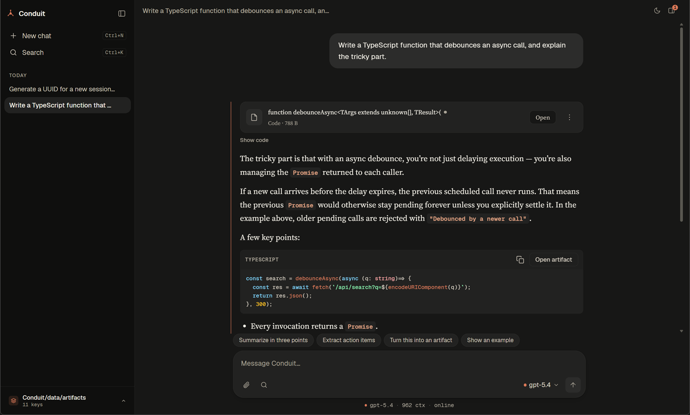
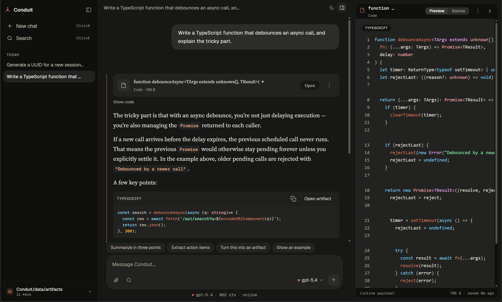
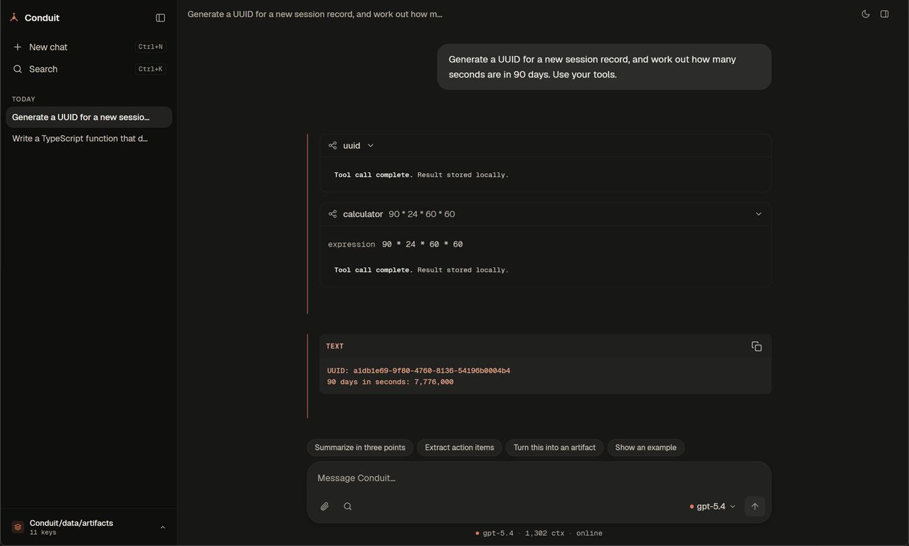

# Conduit

**A local-first desktop AI assistant. Your conversations stay on your machine.**

[conduitllm.com](https://conduitllm.com)

[](https://github.com/runningpixels/conduit/actions/workflows/ci.yml)
[](./LICENSE)




Conduit is a desktop chat client for large language models, built on Tauri 2
with a Rust core and a React renderer. You bring your own API key, talk to any
of eleven providers, and everything — conversations, attachments, artifacts —
is stored locally in an encrypted SQLite database. There is no Conduit account,
no backend, and no telemetry.

## Why Conduit

- **The renderer never sees your API key.** Credentials live in the OS keychain;
  settings hold only a `keychain://conduit/<provider>` reference. All network
  calls happen in Rust. This is enforced by the architecture, not by policy —
  see [`docs/architecture/foundation-contracts.md`](./docs/architecture/foundation-contracts.md).
- **Encrypted at rest.** AES-256-GCM over attachment and artifact blobs, with a
  master key wrapped in the OS keychain. Encryption never silently downgrades:
  if the key is unavailable and encrypted data exists, the app refuses to start
  rather than fall back to plaintext.
- **Bring your own provider.** Anthropic, OpenAI, Gemini, OpenRouter, OpenCode
  Zen, Groq, DeepSeek, Mistral, LM Studio, Ollama, and any OpenAI-compatible
  endpoint.
- **MCP connectors with a real consent gate.** Local stdio Model Context
  Protocol servers run under a supervisor with restart backoff, a concurrency
  cap, and per-call timeouts. Side-effecting tools prompt before they run, tool
  output is redacted and size-capped, and it is never re-injected into the
  prompt.
- **Artifacts that can't phone home.** Model-generated HTML renders in a
  null-origin sandboxed iframe under a strict CSP with `connect-src 'none'` and
  no Tauri bridge. Text, code, JSON and Markdown render through React-escaped
  renderers with no `dangerouslySetInnerHTML` anywhere in the safe path.
- **No telemetry.** Update checks are opt-in and send only
  `Conduit-Updater/<version>`.


### Artifacts

Model-generated code, HTML, JSON and Markdown open in a side panel with preview
and source views. HTML renders in a null-origin sandboxed iframe with
`connect-src 'none'` — it cannot reach the network or the Tauri bridge.



### MCP connectors

Local stdio MCP servers run under a supervisor. Tool calls are disclosed inline,
results are redacted and size-capped, and side-effecting tools prompt for
consent before they run.



## Status

**v0.1.0-rc.1 — pre-release.** Installers for Windows, macOS (Apple silicon and
Intel) and Linux are on the [releases page](https://github.com/runningpixels/conduit/releases).
They are not OS-code-signed, so the first launch shows a Gatekeeper or
SmartScreen warning. Building from source works too.

This is a working application, not a prototype, but it is a release candidate
rather than a 1.0. Expect rough edges.

| Area | State |
|---|---|
| Provider streaming (11 adapters, cancellation, normalization) | Working |
| Local SQLite persistence, migrations, encryption at rest | Working |
| MCP connector runtime (stdio transport, consent, supervision) | Working |
| Artifacts — create, render, edit, export | Working |
| Multi-round agent loop with tool results | Working |
| Update/packaging pipeline | Working — rc.1 built, signed and published on all four targets; the updater itself is not yet verified by a real install |
| MCP HTTP/SSE transport | Not implemented (stdio only) |
| OS code-signing | Not done — bundles are unsigned |
| Cloud sync / accounts | Not planned in this repository |

## Building from source

### Prerequisites

- **Node 20** and **pnpm 10.34.4** (`corepack enable && corepack prepare pnpm@10.34.4 --activate`)
- **Rust stable** ([rustup](https://rustup.rs)) — `rust-toolchain.toml` pins the channel
- Platform toolchain:
  - **Windows** — Visual Studio 2022 Build Tools with the C++ workload. Run
    `./check-setup.ps1` to verify.
  - **macOS** — Xcode Command Line Tools (`xcode-select --install`), macOS 11+.
  - **Linux** —
    ```bash
    sudo apt-get install -y libwebkit2gtk-4.1-dev libgtk-3-dev \
      libayatana-appindicator3-dev librsvg2-dev patchelf build-essential libssl-dev
    ```

### Build and run

```bash
git clone https://github.com/runningpixels/conduit
cd conduit
pnpm install
pnpm dev          # Vite on :5173, then the Tauri shell
```

`pnpm build` produces a release bundle. On first launch, onboarding asks for a
provider key (or point it at a local Ollama instance, which needs no key).

### Checks

```bash
cargo fmt --all --check
cargo clippy --workspace --all-targets -- -D warnings
cargo test --workspace                 # 384 tests
pnpm -C packages/config-schema check   # schema-drift gate
pnpm -C apps/desktop check             # tsc -b
pnpm -C apps/desktop test              # 743 renderer tests
```

## Where your data lives

Everything is under one per-user directory resolved by `directories::ProjectDirs`:

| Platform | Path |
|---|---|
| Windows | `%LOCALAPPDATA%\Conduit\Conduit\data` |
| macOS | `~/Library/Application Support/com.Conduit.Conduit` |
| Linux | `~/.local/share/conduit` |

It contains `settings.json`, `conduit.sqlite`, and the `attachments/`,
`artifacts/`, `exports/`, `logs/`, `diagnostics/`, `updates/` and `streams/`
folders. API keys are **not** there — they are in the OS keychain. Deleting that
directory resets the app completely.

## Architecture

A polyglot monorepo: a Cargo workspace and a pnpm workspace sharing one root.

```text
apps/desktop/            Tauri app — src/ (React renderer) + src-tauri/ (Rust backend)
crates/provider-core/    Provider-agnostic LLM abstraction, adapters, the trust boundary
crates/mcp-runtime/      MCP transport + protocol core (stdio live, HTTP/SSE scaffold)
packages/config-schema/  Generated TS mirror of the Rust schema (@conduit/config-schema)
packages/ui/             Design tokens, primitives, bundled fonts (@conduit/ui)
```

The invariant everything else follows: **the renderer presents state and intent
only; Rust owns secrets, persistence, and privileged operations.** A chat turn:

```text
React ChatView
  └─ ipc/client.startChatStream(ProviderRequest, onEvent)
       └─ Tauri invoke('start_chat_stream', { request, channel })   ← per-request Channel
            └─ StreamManager
                 ├─ provider_core::get_adapter(active_provider)
                 ├─ build_adapter_context   (key from keychain, base URL from settings)
                 ├─ adapter.stream_chat(request, ctx, CancellationToken)
                 └─ per ProviderEvent: append to the event log (one txn) → channel.send
  Renderer: streamState.ts folds ProviderEvents into AssistantStreamState and renders it
```

Persistence is an append-only event log plus a materialized message view, with
`view == fold(events)` as a checked invariant — the view is rebuilt from the log
on drift or crash recovery.

`crates/provider-core/src/schema.rs` is the single source of truth for on-wire
types; `packages/config-schema/src/generated/` is generated from it by ts-rs and
CI fails if the two drift. **Never hand-edit the generated bindings.**

### Documentation

- [`docs/project-overview.md`](./docs/project-overview.md) — how the pieces fit together
- [`docs/architecture/foundation-contracts.md`](./docs/architecture/foundation-contracts.md) — the trust boundary
- [`docs/adr/`](./docs/adr/) — nine architecture decision records
- [`docs/schemas/internal-models.md`](./docs/schemas/internal-models.md) — canonical data shapes
- [`docs/postmortems/`](./docs/postmortems/) — incident write-ups
- [`docs/release/`](./docs/release/), [`docs/support/runbook.md`](./docs/support/runbook.md) — operations

## Contributing

Contributions are welcome — see [`CONTRIBUTING.md`](./CONTRIBUTING.md).

**Note:** Conduit requires contributors to sign a Contributor License Agreement
so the project can continue to be offered under both the AGPL and a commercial
license. The CLA bot will prompt you on your first pull request.

## Security

Please do **not** open public issues for vulnerabilities. See
[`SECURITY.md`](./SECURITY.md) for private disclosure.

## License

Copyright (C) 2026 Emilio Olivares. Licensed under the
[GNU AGPL v3.0 only](./LICENSE).

If you run a modified version as a network service, AGPL section 13 requires you
to offer its source to users. Conduit is a local desktop app, so this does not
apply to normal use. See [`LICENSING.md`](./LICENSING.md) for scope, the section
7 OpenSSL permission, and commercial-licensing terms;
[`NOTICE`](./NOTICE) for third-party attributions.

## Acknowledgements

Built with [Tauri](https://tauri.app), [React](https://react.dev),
[sqlx](https://github.com/launchbadge/sqlx) and
[rustls](https://github.com/rustls/rustls). Typeset in
[Geist](https://github.com/vercel/geist-font) and
[Source Serif 4](https://github.com/adobe-fonts/source-serif), both OFL-1.1.
Syntax highlighting by [Prism](https://prismjs.com).
