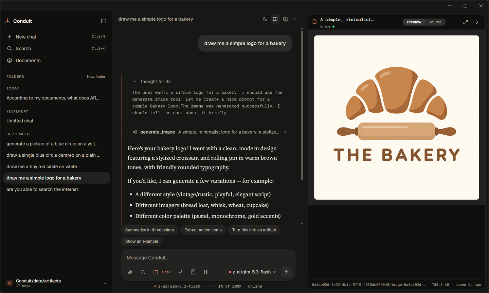
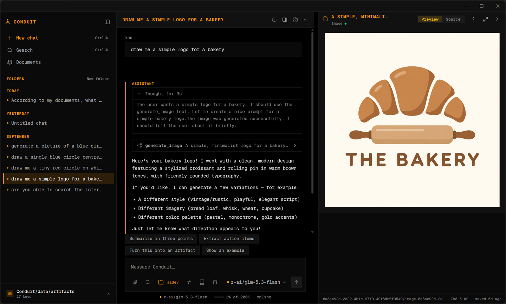
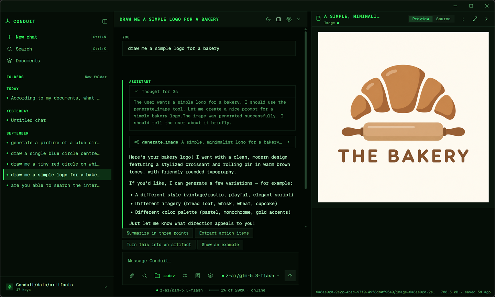
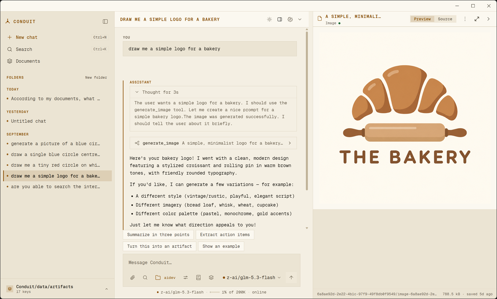
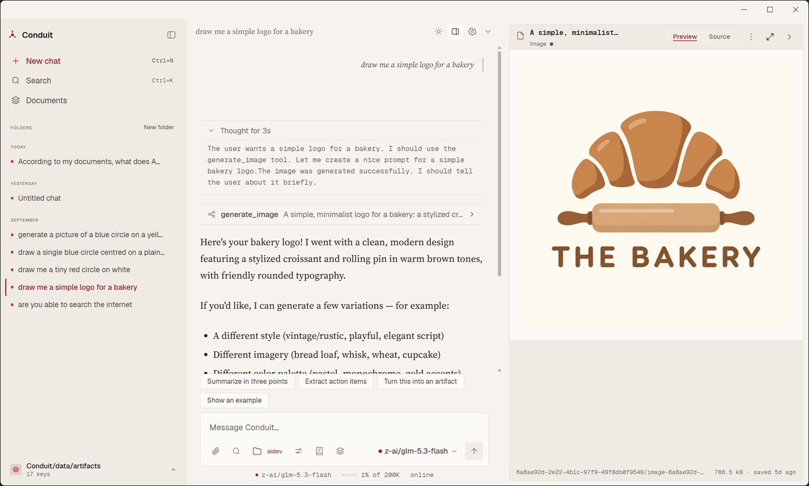
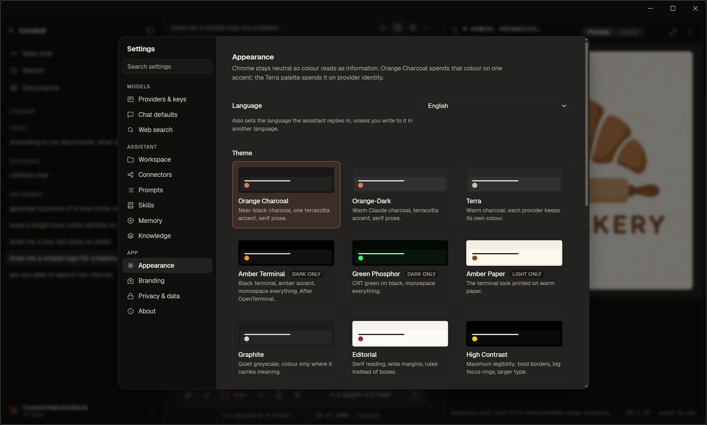

<!-- i18n-source: c64c893 -->

<!-- i18n-nav:start -->
<!-- Generated by scripts/readme-i18n.mjs — do not edit by hand. -->

[English](./README.md) &nbsp;·&nbsp; [Deutsch](./README.de.md) &nbsp;·&nbsp; [Español](./README.es.md) &nbsp;·&nbsp; [Français](./README.fr.md) &nbsp;·&nbsp; [日本語](./README.ja.md) &nbsp;·&nbsp; [한국어](./README.ko.md) &nbsp;·&nbsp; **Português (Brasil)** &nbsp;·&nbsp; [简体中文](./README.zh-CN.md)

<!-- i18n-nav:end -->

# Conduit

**Um assistente de IA para desktop que funciona primeiro no local. Suas conversas ficam na sua máquina.**

[conduitllm.com](https://conduitllm.com/pt-BR)

[](https://github.com/runningpixels/conduit/actions/workflows/ci.yml)
[](./LICENSE)




O Conduit é um cliente de chat para desktop voltado a grandes modelos de
linguagem, construído sobre o Tauri 2 com um núcleo em Rust e um renderizador em
React. Você traz a sua própria chave de API, conversa com qualquer um dos
dezessete provedores, e tudo — conversas, anexos, artefatos — fica armazenado
localmente em um banco SQLite no seu próprio disco, com criptografia em
repouso opcional. Não há conta do Conduit, nem backend, nem telemetria.

## Por que o Conduit

- **O renderizador nunca vê a sua chave de API.** As credenciais ficam no
  chaveiro do sistema operacional; as configurações guardam apenas uma
  referência `keychain://conduit/<provider>`. Todas as chamadas de rede
  acontecem em Rust. Quem garante isso é a arquitetura, não uma política — veja
  [`docs/architecture/foundation-contracts.md`](./docs/architecture/foundation-contracts.md).
- **Criptografia em repouso opcional.** AES-256-GCM sobre os blobs de anexos e
  artefatos e várias colunas do banco de dados, com uma chave mestra guardada
  no chaveiro do sistema. Ela vem **desativada por padrão**
  (`AppSettings.encryption_at_rest`) e ainda não cobre o conteúdo das
  mensagens. A criptografia nunca é rebaixada em silêncio: se a chave estiver
  indisponível e existirem dados criptografados, o aplicativo se recusa a
  iniciar em vez de recorrer a texto puro.
- **Traga o seu provedor.** Anthropic, OpenAI, Gemini, OpenRouter, OpenCode Zen,
  Groq, DeepSeek, Mistral, xAI, Z.ai, Moonshot AI, Qwen, Together AI, Fireworks
  AI, LM Studio, Ollama e qualquer endpoint compatível com a OpenAI.
- **Conectores MCP com um portão de consentimento de verdade.** Servidores do
  Model Context Protocol locais por stdio e remotos por HTTP em streaming rodam
  sob um supervisor com espera progressiva na reinicialização, limite de
  concorrência e tempo máximo por chamada. Ferramentas com efeitos colaterais
  pedem autorização antes de executar, a saída delas é mascarada e limitada em
  tamanho, e nunca é reinjetada no prompt.
- **Artefatos que não conseguem ligar para casa.** O HTML gerado pelo modelo é
  renderizado em um iframe isolado de origem nula, sob uma CSP estrita com
  `connect-src 'none'` e sem ponte do Tauri. Texto, código, JSON e Markdown
  passam por renderizadores com escape do React, sem nenhum
  `dangerouslySetInnerHTML` no caminho seguro.
- **Sem telemetria.** A verificação de atualizações é opcional e envia apenas
  `Conduit-Updater/<version>`. Por padrão a verificação é manual; a verificação
  em segundo plano e a instalação ao fechar são opcionais, e o Conduit nunca se
  reinicia sozinho.

## Funcionalidades

### Seus documentos, pesquisáveis a partir de um chat

**Documentos**, na barra lateral, reúne coleções dos seus próprios arquivos —
texto simples, Markdown, CSV, Word e PDF — ou arraste arquivos para qualquer
lugar da janela. Anexe uma coleção pelo campo de mensagem e o assistente
pesquisa nela enquanto responde; cada documento usado é citado abaixo da
resposta, e clicar nele mostra o trecho exato. A pesquisa é híbrida: pesquisa
semântica para trechos com o mesmo sentido, pesquisa por palavra-chave para
termos exatos como códigos de erro e nomes.

Os PDFs são lidos na sua máquina. A indexação envia o texto de um documento ao
provedor que incorpora a coleção, então você é consultado antes de o primeiro
documento ir para cada provedor, e pode revogar esse consentimento a qualquer
momento. Com o modo somente local ativado, uma coleção precisa de um provedor
local, como o Ollama. Até você criar uma coleção, nada muda no chat.

### Geração de imagens

Na OpenAI, no Gemini e no OpenRouter, peça uma imagem — "desenhe um logotipo
simples para uma padaria" — e você recebe uma, salva com o chat e exibida no
painel de artefatos (a captura de tela no topo). As imagens são armazenadas
localmente, não vinculadas ao provedor, então não desaparecem quando uma URL
remota expira. Cada imagem é cobrada, então o Conduit pede confirmação antes
da primeira.

### Artefatos

Código, HTML, JSON e Markdown gerados pelo modelo abrem em um painel lateral com
visualizações de prévia e de código-fonte. O HTML é renderizado em um iframe
isolado de origem nula com `connect-src 'none'` — ele não alcança nem a rede nem
a ponte do Tauri.

Você pode acompanhar um documento sendo escrito, com uma prévia ao vivo
opcional. Documentos longos demais para uma única resposta são construídos
seção por seção, e um turno que fica sem tempo mantém o que já escreveu e
oferece **Continuar construindo**. As revisões alteram só a parte que muda. O
painel pode ser expandido (`Ctrl+Shift+E`) para ocupar tudo, menos uma coluna
estreita de chat.


### Conectores MCP

Servidores MCP locais por stdio e remotos por HTTP em streaming rodam sob um
supervisor. As chamadas de ferramentas são exibidas em linha, os resultados são
mascarados e limitados em tamanho, e ferramentas com efeitos colaterais pedem
consentimento antes de executar.

Os prompts e recursos de um servidor também ficam acessíveis pelo campo de
mensagem, não só as ferramentas dele. O seletor de prompts preenche os
argumentos que um prompt declara e coloca o resultado no campo de mensagem
para você editar; o seletor de recursos anexa um documento à próxima
mensagem, verificado antes de chegar ao modelo.


### Temas

Um tema define a tipografia, os raios de canto, as bordas, a elevação e as
animações, além das cores. Nove vêm prontos — Orange Charcoal (o padrão,
mostrado no topo), Orange-Dark, Terra, Amber Terminal, Green Phosphor, Amber
Paper, Graphite, Editorial e High Contrast (contraste AAA) — escolhidos em
Configurações → Aparência ou durante a configuração inicial. A opção Fonte de
leitura escolhe a fonte das respostas do assistente.

<table>
  <tr>
    <td><br><b>Amber Terminal</b></td>
    <td><br><b>Green Phosphor</b></td>
  </tr>
  <tr>
    <td><br><b>Amber Paper</b></td>
    <td><br><b>Editorial</b></td>
  </tr>
</table>



Você também pode escrever o seu: um arquivo `.theme.md` na pasta `themes` do
aplicativo estende um tema pronto com suas próprias cores. Os arquivos de tema
aceitam apenas cores em hexadecimal e um conjunto fixo de opções estruturais —
sem CSS, sem URLs. Veja
[`docs/theming/user-themes.md`](./docs/theming/user-themes.md).

### Oito idiomas

A interface está disponível em inglês, alemão, espanhol, francês, japonês,
coreano, português brasileiro e chinês simplificado. O idioma escolhido também
define o idioma em que o assistente responde, e datas, números e tamanhos de
arquivo seguem esse idioma em vez da região configurada na máquina.

### E mais

- **Mais seis provedores** na rc.5 — xAI, Z.ai, Moonshot AI, Qwen, Together AI
  e Fireworks AI — cada um com um campo de URL base para endpoints regionais
  ou auto-hospedados. Anthropic e OpenAI também ganharam um, então qualquer um
  dos dois pode apontar para um endpoint compatível ou um proxy LiteLLM.
- **A configuração inicial** começa pelo idioma, tema e tamanho do texto,
  cobre o modo somente local, o armazenamento de chaves, a verificação de
  atualizações e os diagnósticos, e termina com uma revisão do que foi
  configurado.
- **A pesquisa nas configurações**, um botão de configurações na barra de
  título, e uma folha de atalhos de teclado (`Ctrl+/`, `⌘/` no macOS).
- **Uma barra lateral redimensionável**, um menu ⋯ em cada chat (renomear,
  fixar, arquivar, mover), e sobreposições para a barra lateral e o painel de
  artefatos em janelas estreitas.

Veja o [`CHANGELOG.md`](./CHANGELOG.md) para tudo o que muda em cada versão.

## Situação

**v0.1.0-rc.6 — versão prévia.** Os instaladores para Windows, macOS (Apple
silicon e Intel) e Linux estão na
[página de versões](https://github.com/runningpixels/conduit/releases). Eles não
são assinados no nível do sistema operacional, então a primeira execução exibe um
aviso do Gatekeeper ou do SmartScreen. Compilar a partir do código também
funciona.

É um aplicativo que funciona, não um protótipo, mas é uma versão candidata e não
uma 1.0. Espere arestas.

> A matriz completa de recursos é mantida somente no
> [README em inglês](./README.md#status), para que não fique desatualizada em
> oito idiomas ao mesmo tempo. O que cada versão inclui está no
> [`CHANGELOG.md`](./CHANGELOG.md).

## Compilando a partir do código

### Pré-requisitos

- **Node 20** e **pnpm 10.34.4** (`corepack enable && corepack prepare pnpm@10.34.4 --activate`)
- **Rust stable** ([rustup](https://rustup.rs)) — o `rust-toolchain.toml` fixa o canal
- Ferramental por plataforma:
  - **Windows** — Visual Studio 2022 Build Tools com a carga de trabalho C++.
    Execute `./check-setup.ps1` para conferir.
  - **macOS** — Xcode Command Line Tools (`xcode-select --install`), macOS 11+.
  - **Linux** —
    ```bash
    sudo apt-get install -y libwebkit2gtk-4.1-dev libgtk-3-dev \
      libayatana-appindicator3-dev librsvg2-dev patchelf build-essential libssl-dev
    ```

### Compilar e executar

```bash
git clone https://github.com/runningpixels/conduit
cd conduit
pnpm install
pnpm dev          # Vite na porta 5173, depois o shell do Tauri
```

`pnpm build` gera um pacote de release. Na primeira execução, o onboarding pede
uma chave de provedor (ou aponte para uma instância local do Ollama, que não
precisa de chave).

### Verificações

```bash
cargo fmt --all --check
cargo clippy --workspace --all-targets -- -D warnings
cargo test --workspace                 # testes de unidade e integração em Rust
pnpm -C packages/config-schema check   # portão de divergência de esquema
pnpm -C apps/desktop check             # tsc -b
pnpm -C apps/desktop test              # testes do renderizador
```

## Onde ficam os seus dados

Tudo fica sob um único diretório por usuário, resolvido por
`directories::ProjectDirs`:

| Plataforma | Caminho |
|---|---|
| Windows | `%LOCALAPPDATA%\Conduit\Conduit\data` |
| macOS | `~/Library/Application Support/com.Conduit.Conduit` |
| Linux | `~/.local/share/conduit` |

Ele contém `settings.json`, `conduit.sqlite` e as pastas `attachments/`,
`artifacts/`, `exports/`, `logs/`, `diagnostics/`, `updates/` e `streams/`. As
chaves de API **não** estão ali — estão no chaveiro do sistema operacional.
Apagar esse diretório redefine o aplicativo por completo.

## Arquitetura

Um monorepo poliglota: um workspace do Cargo e um workspace do pnpm dividindo uma
mesma raiz.

```text
apps/desktop/            Tauri app — src/ (React renderer) + src-tauri/ (Rust backend)
crates/provider-core/    Provider-agnostic LLM abstraction, adapters, the trust boundary
crates/mcp-runtime/      MCP transport + protocol core (stdio and streamable HTTP)
packages/config-schema/  Generated TS mirror of the Rust schema (@conduit/config-schema)
packages/ui/             Design tokens, primitives, bundled fonts (@conduit/ui)
```

A invariante que todo o resto segue: **o renderizador apresenta apenas estado e
intenção; o Rust é dono dos segredos, da persistência e das operações
privilegiadas.** Um turno de conversa:

```text
React ChatView
  └─ ipc/client.startChatStream(ProviderRequest, onEvent)
       └─ Tauri invoke('start_chat_stream', { request, channel })   ← per-request Channel
            └─ StreamManager
                 ├─ provider_core::get_adapter(active_provider)
                 ├─ build_adapter_context   (key from keychain, base URL from settings)
                 ├─ adapter.stream_chat(request, ctx, CancellationToken)
                 └─ per ProviderEvent: append to the event log (one txn) → channel.send
  Renderer: streamState.ts folds ProviderEvents into AssistantStreamState and renders it
```

A persistência é um log de eventos somente-anexação mais uma visão materializada
das mensagens, com `view == fold(events)` como invariante verificada — a visão é
reconstruída a partir do log em caso de divergência ou de recuperação após uma
falha.

`crates/provider-core/src/schema.rs` é a única fonte de verdade para os tipos que
trafegam na rede; `packages/config-schema/src/generated/` é gerado a partir dele
pelo ts-rs, e a CI falha se os dois divergirem. **Nunca edite à mão os bindings
gerados.**

### Documentação

A documentação está em inglês.

- [`docs/project-overview.md`](./docs/project-overview.md) — como as peças se encaixam
- [`docs/architecture/foundation-contracts.md`](./docs/architecture/foundation-contracts.md) — a fronteira de confiança
- [`docs/adr/`](./docs/adr/) — nove registros de decisão de arquitetura
- [`docs/schemas/internal-models.md`](./docs/schemas/internal-models.md) — formatos canônicos dos dados
- [`docs/postmortems/`](./docs/postmortems/) — relatos de incidentes
- [`docs/release/`](./docs/release/), [`docs/support/runbook.md`](./docs/support/runbook.md) — operação

## Contribuindo

Contribuições são bem-vindas — veja [`CONTRIBUTING.md`](./CONTRIBUTING.md).

**Observação:** o Conduit exige que quem contribui assine um Contributor License
Agreement, para que o projeto possa continuar sendo oferecido tanto sob a AGPL
quanto sob licença comercial. O bot do CLA avisará você no seu primeiro pull
request.

## Segurança

Por favor, **não** abra issues públicas para vulnerabilidades. Veja
[`SECURITY.md`](./SECURITY.md) para divulgação privada.

## Licença

Copyright (C) 2026 Emilio Olivares. Licenciado sob a
[GNU AGPL v3.0 only](./LICENSE).

Se você executar uma versão modificada como serviço de rede, a seção 13 da AGPL
exige que ofereça o código-fonte dela aos usuários. O Conduit é um aplicativo de
desktop local, então isso não se aplica ao uso normal. Veja
[`LICENSING.md`](./LICENSING.md) para o alcance, a permissão de OpenSSL da seção
7 e os termos de licenciamento comercial; [`NOTICE`](./NOTICE) para as
atribuições de terceiros.

> **A versão em inglês é a que prevalece.** Esta tradução serve como apoio à
> compreensão. Apenas as versões em inglês de [`LICENSE`](./LICENSE),
> [`LICENSING.md`](./LICENSING.md) e [`CLA.md`](./CLA.md) têm valor jurídico.

## Agradecimentos

Construído com [Tauri](https://tauri.app), [React](https://react.dev),
[sqlx](https://github.com/launchbadge/sqlx) e
[rustls](https://github.com/rustls/rustls). Composto em
[Geist](https://github.com/vercel/geist-font) e
[Source Serif 4](https://github.com/adobe-fonts/source-serif), ambas OFL-1.1.
Realce de sintaxe por [Prism](https://prismjs.com).
