<!-- i18n-source: ab1643b -->

<!-- i18n-nav:start -->
<!-- Generated by scripts/readme-i18n.mjs — do not edit by hand. -->

[English](./README.md) &nbsp;·&nbsp; [Deutsch](./README.de.md) &nbsp;·&nbsp; [Español](./README.es.md) &nbsp;·&nbsp; [Français](./README.fr.md) &nbsp;·&nbsp; [日本語](./README.ja.md) &nbsp;·&nbsp; [한국어](./README.ko.md) &nbsp;·&nbsp; **Português (Brasil)** &nbsp;·&nbsp; [简体中文](./README.zh-CN.md)

<!-- i18n-nav:end -->

# Conduit

**O espaço de trabalho de IA que cria coisas que você guarda, com as suas chaves, na sua máquina.**

[conduitllm.com](https://conduitllm.com/pt-BR)

[](https://github.com/runningpixels/conduit/actions/workflows/ci.yml)
[](./LICENSE)


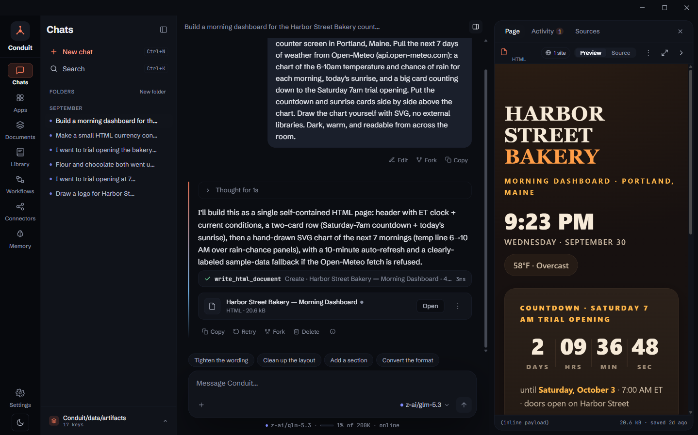

O Conduit é um aplicativo de desktop de código aberto para trabalhar com grandes
modelos de linguagem. Traga a sua própria chave de qualquer um dos dezessete
provedores, ou rode um modelo local com Ollama ou LM Studio, e peça coisas que
você possa guardar: um **app pessoal** que busca dados ao vivo, uma
**apresentação** que você edita pedindo, uma **resposta com citações dos seus
próprios documentos**, um **relatório de pesquisa** em que cada achado é
conferido com a página de onde veio, um **fluxo de trabalho** que roda em um
horário e para para perguntar. Conecte as suas ferramentas por MCP: as
ferramentas que alteram algo, e cada site que uma página quer acessar, pedem
autorização antes.

Tudo fica no seu disco: chats, documentos, apps e apresentações, em um banco
SQLite local com criptografia em repouso opcional. Não há conta do Conduit,
nem backend, nem telemetria. Construído sobre o Tauri 2, com um núcleo em Rust e
uma interface em React.

As capturas de tela seguem um único exemplo: a equipe por trás do *Ferry*, um
app de sincronização de código aberto fictício, feito com Rust e Tauri.

## O que você pode criar

### Apps pessoais

Peça uma ferramenta e você recebe uma página que funciona: um painel, um
conversor, um controle, um jogo. **Salvar como app** (no menu ⋯ da página) a
guarda como um app pessoal que você abre em **Apps** na barra de navegação, e
ela continua funcionando depois que você apaga o chat. O painel acima é um
deles: ele chama a API do GitHub ao vivo, depois de perguntar uma vez por esse
site.

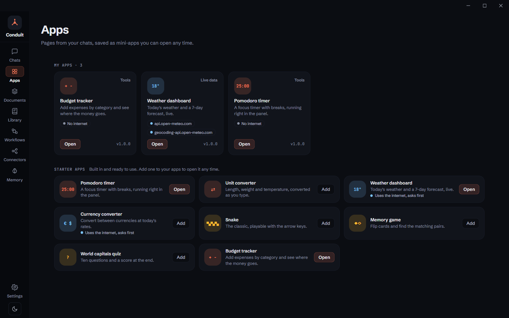

Os apps pessoais podem fazer três coisas que uma página comum em um ambiente
isolado não pode, cada uma declarada pela página e verificada pelo Conduit:

- **Manter dados entre execuções**: um pequeno armazenamento por app (até 5 MB),
  guardado junto com o resto dos seus dados e criptografado quando a
  criptografia em repouso está ativada.
- **Aceitar configurações**: uma página declara algumas entradas, como um
  repositório ou uma cidade, e o Conduit desenha o formulário. Alterá-las
  atualiza o app em execução.
- **Consultar o seu modelo de IA**, depois que você o permite para aquela
  página. O aviso nomeia o provedor e diz com clareza quando o texto sairia do
  seu dispositivo; a página recebe texto de volta e nada mais: sem ferramentas,
  histórico de chat, memória nem documentos.

Cada app pessoal tem a sua própria página de **Configurações**: qual modelo
responde a ele, os tokens por dia com um limite diário para modelos na nuvem
(100.000 por padrão; modelos no seu computador nunca têm limite), os dados
salvos chave por chave com Exportar e Limpar, os sites e provedores que ele pode
usar, e uma semana de registros de atividade de uma linha, nunca prompts,
respostas ou valores salvos. Oito **apps iniciais** já vêm incluídos, de um
timer Pomodoro a um painel do tempo ao vivo.

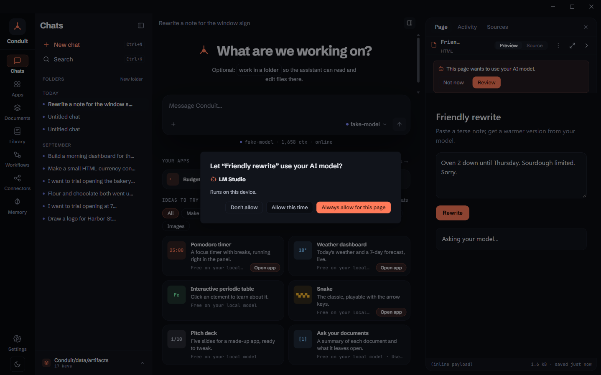

### Slides

Descreva a história, ou peça uma apresentação em qualquer chat. O assistente
redige uma narrativa para você aprovar e depois monta **uma única apresentação
ao vivo**: cada alteração edita essa apresentação, em vez de gerar mais uma
cópia do arquivo. A apresentação abre em um estúdio, com o slide grande no
centro e o chat ao lado.

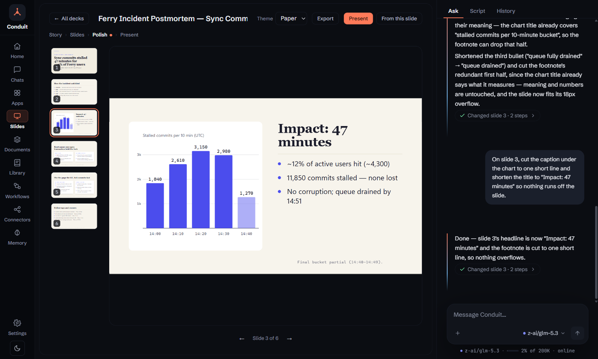

- **Alterações pontuais.** Peça uma alteração e o assistente edita um slide, ou
  troca uma palavra na apresentação inteira. O **Histórico** guarda uma versão
  de cada alteração, rotulada com o seu pedido.
- O **Roteiro** mostra cada palavra da apresentação como um único documento.
  Digite ali, ou clique duas vezes no texto de um slide; o texto que você
  escreve é mantido quando o assistente reescreve um slide, a menos que você
  peça para ele alterar esse texto.
- **Temas:** dois incluídos, mais qualquer tema que o assistente criar para você.
- **Apresentar** em tela cheia, com uma janela separada do apresentador (slide
  atual e próximo, notas do apresentador, um cronômetro) para manter em
  privado enquanto você compartilha os slides.
- **Exportar** como um único arquivo HTML que se apresenta sozinho em qualquer
  navegador, ou como PDF (Windows).

| Roteiro: cada palavra da apresentação como um único documento | A janela do apresentador: próximo slide, notas, cronômetro |
| --- | --- |
| 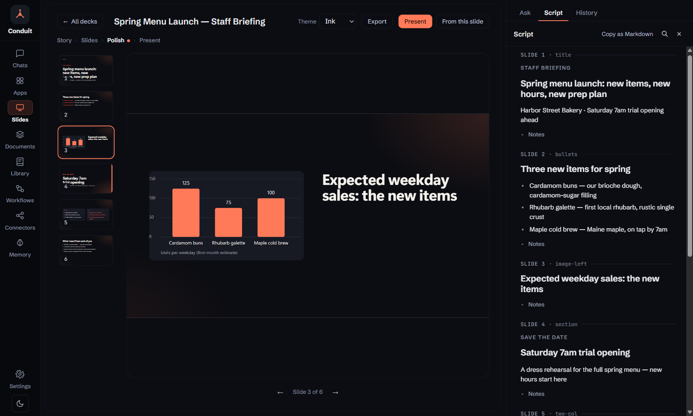 | 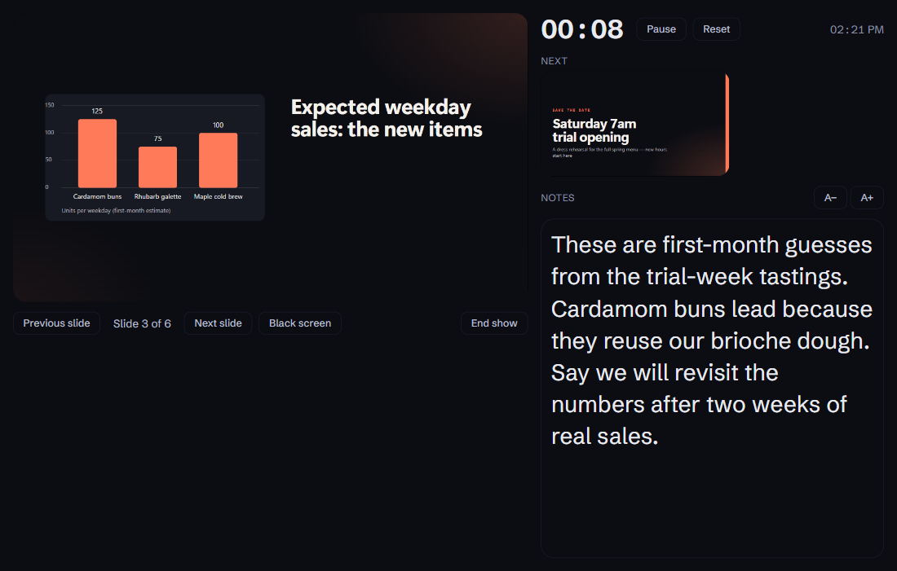 |

### Respostas a partir dos seus próprios documentos

**Documentos** reúne coleções dos seus arquivos (texto simples, Markdown, CSV,
Word e PDF), ou arraste arquivos para qualquer lugar da janela. Anexe uma
coleção a um chat e o assistente pesquisa nela enquanto responde; os documentos
usados são citados junto com a resposta, e clicar em um mostra o trecho exato. A
recuperação é híbrida: pesquisa semântica para trechos com o mesmo sentido,
pesquisa por palavra-chave para termos exatos como códigos de erro e nomes.

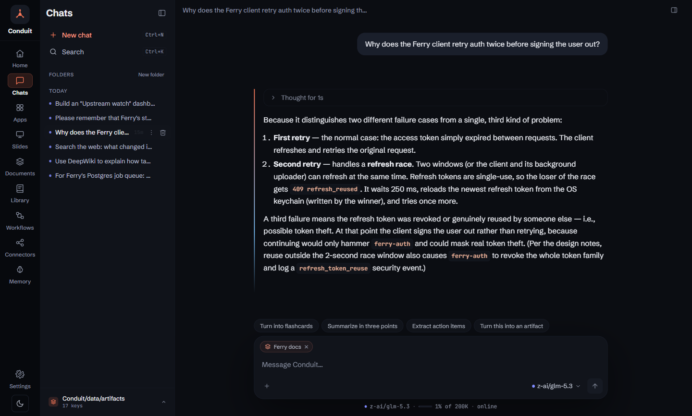

Os PDFs são lidos na sua máquina. A indexação envia o texto de um documento ao
provedor que incorpora a coleção, então você é consultado antes de o primeiro
documento ir para cada provedor, e pode revogar esse consentimento a qualquer
momento. Com o modo somente local ativado, uma coleção precisa de um provedor
local, como o Ollama.

### Pesquisa

Para uma pergunta que exige mais do que uma busca rápida, ative **Pesquisa** no
menu **+** do campo de mensagem (ou escolha-a no Início). Ela começa propondo um
briefing: as subperguntas que vai responder, um escopo e uma profundidade
(Rápida, Padrão ou Profunda, cada uma com seus limites de buscas, páginas e
tempo), que você edita e aprova. Depois ela busca, lê as páginas por inteiro,
tanto páginas web quanto PDFs, e extrai fatos, cada um com as palavras exatas
que o sustentam. Um fato só conta se essas palavras estiverem mesmo na página;
quem confere isso é o app, não o modelo. Ela busca de novo o que ainda está sem
resposta e então escreve um relatório nos documentos do chat: um resumo, achados
por subpergunta, perguntas em aberto e fontes numeradas, com cada achado citado.
O texto das páginas só chega a uma chamada ao modelo sem ferramentas, então uma
página que tente dar instruções não consegue fazer o app buscar, baixar ou
salvar nada.

## Coisas que rodam por você

### Fluxos de trabalho

Os **fluxos de trabalho** executam rotinas para você: buscar páginas, pesquisar
na web, pedir ao modelo que resuma e salvar o resultado como documento. Comece
por um já pronto (um resumo matinal, um resumo de página, um monitor de tópico)
ou monte o seu passo a passo, e depois execute agora ou em um horário
programado. Ao ativar um horário pela primeira vez, o Conduit mostra tudo o que
o fluxo poderá fazer por conta própria, para você aprovar, e uma execução que
precisa de mais pausa e pergunta.

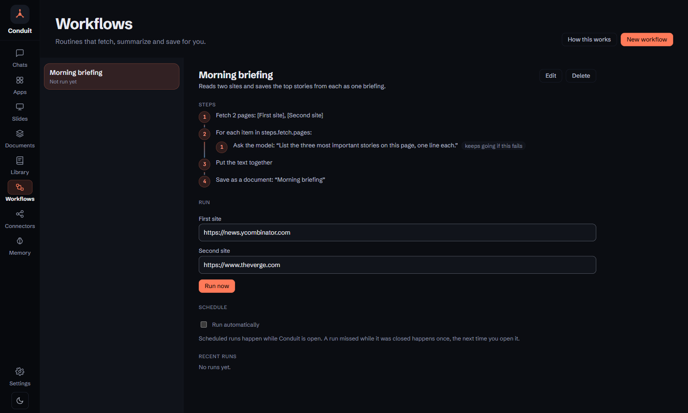

### Conectores MCP

Adicione um conector pesquisando no registro oficial do MCP, colando a URL de um
servidor remoto ou executando um comando local. Servidores locais por stdio e
remotos por HTTP em streaming rodam sob um supervisor com espera progressiva na
reinicialização, limite de concorrência e tempo máximo por chamada. As chamadas
de ferramentas são exibidas em linha, os resultados são mascarados e limitados
em tamanho, e uma ferramenta pede autorização antes de executar, a menos que o
servidor dela a marque como somente leitura; você pode lembrar uma aprovação
para um chat ou para sempre, e revisar essas aprovações na página Conectores.

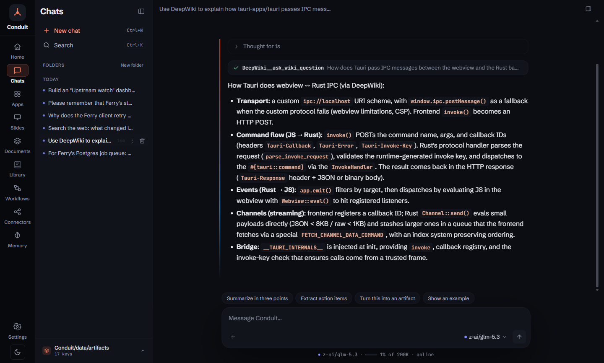

Os prompts e recursos de um servidor também ficam acessíveis pelo campo de
mensagem, não só as ferramentas dele: o seletor de prompts preenche os
argumentos de um prompt, e o seletor de recursos anexa um documento à próxima
mensagem.

## Tudo o mais que você esperaria

### Início

O aplicativo abre em **Início**. Um único campo começa qualquer coisa: peça uma
apresentação e o Slides abre com uma narrativa; qualquer outra coisa começa um
chat. Abaixo dele, **Precisa de você** lista as aprovações e perguntas de
fluxos de trabalho e as sugestões de memória que aguardam por você,
**Continue de onde parou** mostra os seus chats, apresentações e apps mais
recentes, e cada área do aplicativo fica em um bloco com uma contagem ao vivo,
ou um exemplo para experimentar enquanto está vazia. `Ctrl+1` a `Ctrl+9` (`⌘` no
macOS) levam a cada área, e a paleta de comandos (`Ctrl+K`) tem uma entrada
"Ir para" para cada uma.

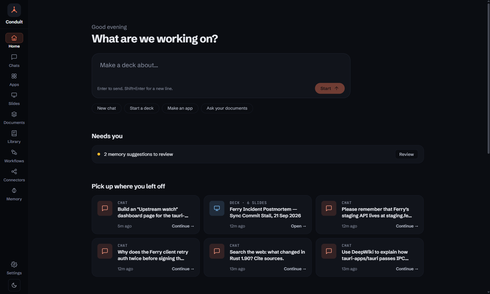

### Todos os modelos, e a web

Escolha no campo de mensagem qualquer modelo que você tenha configurado:
Anthropic, OpenAI, Gemini, OpenRouter, OpenCode Zen, Groq, DeepSeek, Mistral,
xAI, Z.ai, Moonshot AI, Qwen, Together AI, Fireworks AI, LM Studio, Ollama, ou
qualquer endpoint compatível com a OpenAI. Quando um chat se aproxima da janela
de contexto do modelo, os turnos mais antigos são resumidos automaticamente
para que ele continue.

A **busca na web** funciona em qualquer modelo, sem configuração. OpenAI, Gemini,
Anthropic e OpenRouter usam a própria busca integrada; qualquer outro modelo
pesquisa pelo Exa, que não precisa de chave, ou por um serviço à sua escolha
(Tavily, Brave ou o seu próprio SearXNG), com um link em Configurações para obter
uma chave. Listas de domínios permitidos e bloqueados a restringem, e as fontes
aparecem junto com a resposta e no inspetor.

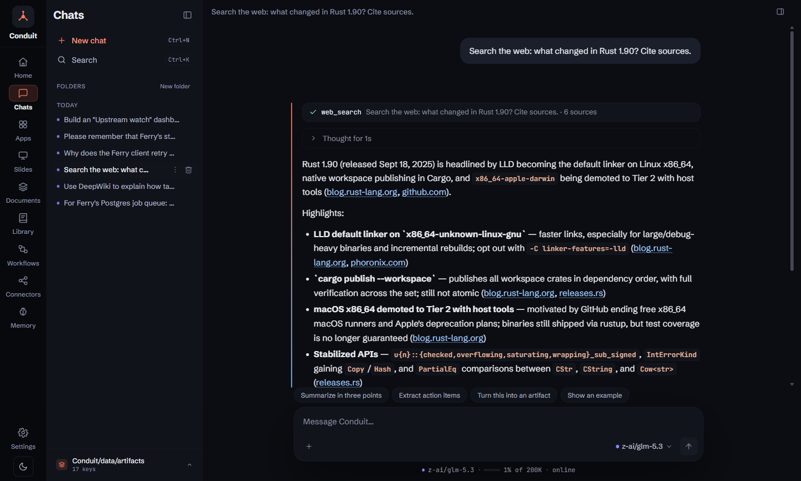

O **+** no campo de mensagem adiciona imagens, busca na web, uma pasta do
espaço de trabalho que o assistente pode ler e editar, coleções de documentos,
skills e prompts de conectores. Enquanto um turno está em andamento, você pode
enfileirar uma continuação ou interromper e redirecionar. As chamadas de
ferramentas, pesquisas e sites aparecem na aba **Atividade** do inspetor, com os
tempos, e aquilo em que a resposta se baseou fica em **Fontes**.

### Biblioteca: prompts e skills

A **Biblioteca** guarda os prompts que você reutiliza, em pastas e com tags. Um
prompt pode ter `{{variables}}`, que você preenche ao inseri-lo no campo de
mensagem. A aba **Skills** reúne pacotes de skills `SKILL.md`: instruções e
arquivos que o assistente carrega em um chat quando você adiciona a skill.

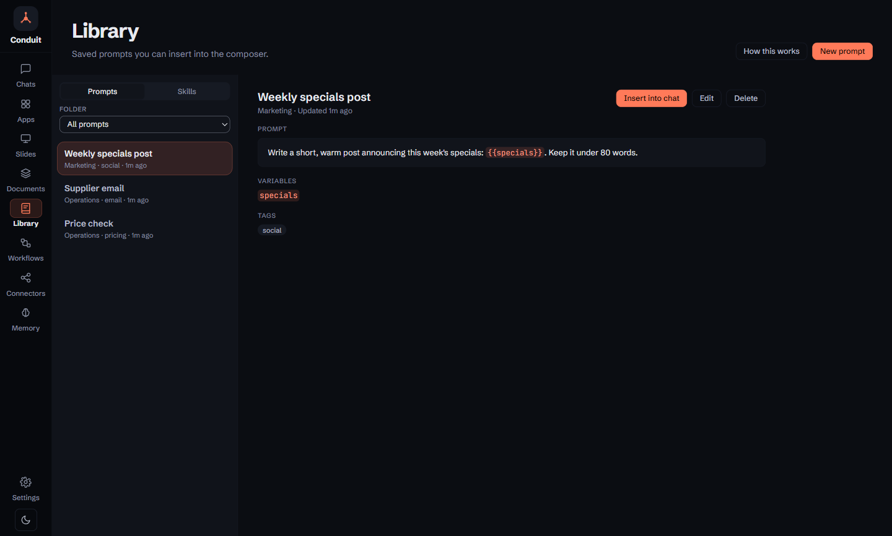

### Memória

A **Memória** guarda fatos que o assistente mantém em mente em todos os chats.
Ele pode propor algo para lembrar durante um chat, mas a proposta espera por
você e nunca é usada até que você a salve. A lista é sua para ler, editar,
fixar como essencial ou excluir, e um único interruptor impede de uma vez que a
memória salva seja adicionada aos chats. A Memória é criptografada no disco.

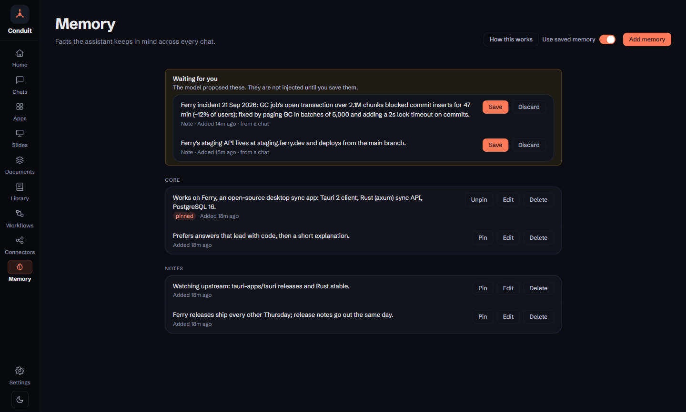

### Geração de imagens

Na OpenAI, no Gemini e no OpenRouter, peça uma imagem e você recebe uma, salva
com o chat e exibida no painel lateral. As imagens são armazenadas localmente,
não vinculadas ao provedor, então não desaparecem quando uma URL remota expira.
Cada imagem é cobrada, então o Conduit pede confirmação antes da primeira.

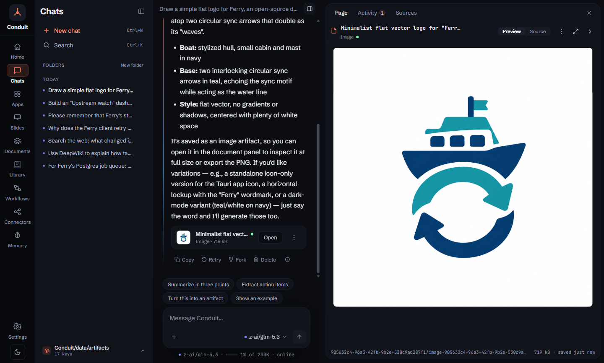

### Páginas e artefatos

Código, HTML, JSON e Markdown gerados pelo modelo abrem em um painel lateral com
visualizações de prévia e de código-fonte. O HTML é renderizado em um iframe
isolado de origem nula com `connect-src 'none'`; sozinho, ele não alcança nem a
rede nem o aplicativo. Uma página que chama `fetch()` mostra um banner com o
nome do site, e você permite só desta vez, sempre para essa página, ou não
permite. O globo no cabeçalho do painel lista todos os sites e solicitações.
Documentos longos são construídos seção por seção, um turno que fica sem tempo
oferece **Continuar construindo**, e as revisões alteram só a parte que muda.

### Aparência e idiomas

Um design em dois modos (escuro, claro ou seguindo o sistema), com uma cor
principal que você pode escolher para cada modo. A interface está disponível em
inglês, alemão, espanhol, francês, japonês, coreano, português brasileiro e
chinês simplificado; datas, números e tamanhos de arquivo seguem o idioma que
você escolher.

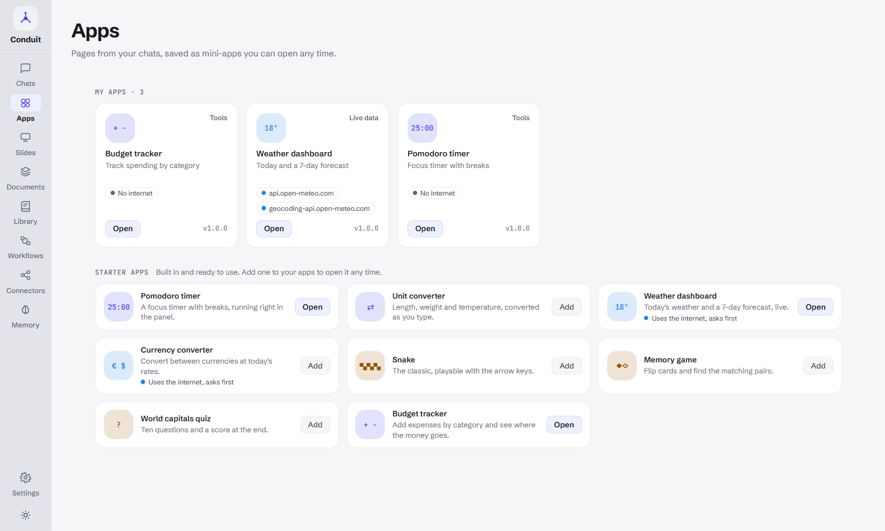

### E mais

- **Uma URL base para cada provedor** onde faz sentido (xAI, Z.ai, Moonshot
  AI, Qwen, Together AI, Fireworks AI, Anthropic e OpenAI) para endpoints
  regionais ou auto-hospedados, uma API compatível ou um proxy LiteLLM.
- **A configuração inicial** cobre idioma, tema, tamanho do texto, modo somente
  local, armazenamento de chaves, verificação de atualizações e diagnósticos.
- **Ideias**: uma página de coisas para experimentar, cada uma iniciando um chat
  com o prompt preenchido, escolhidas no seu dispositivo a partir do que você já
  experimentou.
- **As conversas** podem ser fixadas, arquivadas, organizadas em pastas e
  exportadas; a lista de chats mostra qual chat está em execução ou precisa de
  você.
- **Anexos de imagem, diagramas Mermaid e matemática em KaTeX** nas respostas.
- **A pesquisa nas configurações** e uma folha de atalhos de teclado
  (`Ctrl+/`, `⌘/` no macOS).
- **Marca própria (white-label)**: um nome, um símbolo e cores a partir de um
  `brand.md`.

Veja o [`CHANGELOG.md`](./CHANGELOG.md) para tudo o que muda em cada versão.

## Confiança que você pode conferir

- **A interface nunca vê a sua chave de API.** As chaves ficam no chaveiro do
  sistema operacional; as configurações guardam apenas uma referência
  `keychain://conduit/<provider>`, e todas as chamadas de rede acontecem em
  Rust. Quem garante isso é a arquitetura; veja
  [`docs/architecture/foundation-contracts.md`](./docs/architecture/foundation-contracts.md).
- **Tudo pede autorização antes.** Cada site que uma página quer acessar, cada
  chamada de ferramenta com efeitos colaterais, as permissões de cada fluxo de
  trabalho agendado, cada provedor que indexa os seus documentos e a primeira
  imagem cobrada.
- **Criptografia em repouso opcional.** AES-256-GCM sobre os blobs de anexos e
  artefatos e várias colunas do banco de dados, com uma chave mestra guardada
  no chaveiro do sistema. Ela vem **desativada por padrão**
  (`AppSettings.encryption_at_rest`) e ainda não cobre o conteúdo das
  mensagens. A criptografia nunca é rebaixada em silêncio: se a chave estiver
  indisponível e existirem dados criptografados, o aplicativo se recusa a
  iniciar em vez de recorrer a texto puro.
- **O modo somente local** recusa por completo os provedores na nuvem, de modo
  que só um modelo local, como o Ollama ou o LM Studio, pode responder.
- **Sem telemetria.** A verificação de atualizações é opcional e envia apenas
  `Conduit-Updater/<version>`. Por padrão a verificação é manual; a verificação
  em segundo plano e a instalação ao fechar são opcionais, e o Conduit nunca se
  reinicia sozinho.

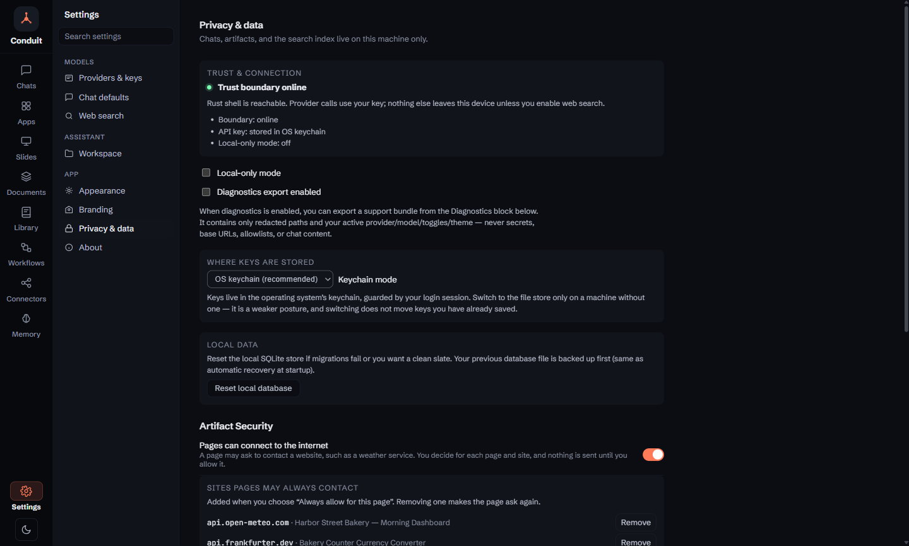

## Situação

**v1.0.0-rc.6 — versão candidata.** Os instaladores para Windows, macOS (Apple
silicon e Intel) e Linux estão na
[página de versões](https://github.com/runningpixels/conduit/releases). Eles não
são assinados no nível do sistema operacional, então a primeira execução exibe um
aviso do Gatekeeper ou do SmartScreen. Compilar a partir do código também
funciona.

Esta é a versão candidata da 1.0: tudo o que está abaixo funciona, e o que falta
é verificá-la em instalações reais antes de chamá-la de final.

| Área | Estado |
|---|---|
| Streaming de provedores (17 provedores, cancelamento, normalização) | Funcionando |
| Persistência local em SQLite, migrações, criptografia em repouso | Funcionando |
| Runtime de conectores MCP (stdio e HTTP em streaming, consentimento, supervisão) | Funcionando |
| Artefatos — criar, renderizar, editar, exportar | Funcionando |
| Loop de agente em várias rodadas com resultados de ferramentas | Funcionando |
| Controle de execução do agente — fila de continuações, interromper/redirecionar, memória de aprovação por ferramenta | Funcionando |
| Medidor de contexto com compactação automática | Funcionando |
| Skills (`SKILL.md`) e memória criptografada aprovada pelo usuário | Funcionando |
| Fixar, arquivar e organizar conversas em pastas | Funcionando |
| Anexos de imagem, Mermaid/KaTeX, exportação de conversas | Funcionando |
| Busca na web (OpenAI/Gemini/Anthropic/OpenRouter hospedados + Exa, Tavily, Brave, SearXNG) | Funcionando |
| Base de conhecimento — coleções de documentos com recuperação híbrida e citações | Funcionando |
| Pesquisa — briefing aprovado, lê páginas web e PDFs, afirmações com citação conferida, relatório citado | Funcionando |
| Geração de imagens (OpenAI, Gemini, OpenRouter) | Funcionando |
| Prompts e recursos MCP no campo de mensagem | Funcionando |
| Um design em escuro e claro, com ajuste da cor principal | Funcionando |
| Fluxos de trabalho — prontos e personalizados, executar agora ou em um horário, com aprovação | Funcionando |
| Apps pessoais — salvar uma página, oito apps iniciais, armazenamento por app, configurações, acesso ao modelo e limites de uso | Funcionando |
| Slides — narrativa, uma apresentação ao vivo, Roteiro, histórico, temas, apresentar com janela do apresentador | Funcionando |
| Exportação do Slides — HTML em todas as plataformas, PDF no Windows | Funcionando |
| Início — campo de pedido, precisa de você, continue de onde parou, blocos de áreas, navegação com `Ctrl+1`…`9` | Funcionando |
| Interface em oito idiomas | Funcionando |
| Pipeline de atualização/empacotamento, com atualizações automáticas opcionais | Funcionando — a 1.0.0-rc.6 foi compilada, assinada e publicada nos quatro alvos; o atualizador em si ainda não foi verificado em uma instalação real |
| Assinatura de código do SO | Não feita — os pacotes não são assinados |
| Sincronização na nuvem / contas | Não planejado neste repositório |

### Problemas conhecidos

- **macOS: uma página pode abrir uma conexão WebRTC.** A política de
  segurança de conteúdo de uma página não cobre o WebRTC, então, no macOS, o
  script de uma página poderia alcançar um host por STUN/TURN mesmo sem
  permissão de rede. Windows e Linux bloqueiam isso no próprio webview; o macOS
  não tem uma configuração de webview para isso, então lá só o próprio script
  da página o remove, o que não é uma barreira. No macOS, abra com cuidado
  páginas HTML e apps que você recebeu de outra pessoa.
- **Voltar para a rc.2 ou anterior começa com um banco de dados vazio.** A rc.3
  acrescentou itens ao banco de dados local para o Slides; uma versão mais
  antiga não consegue lê-lo e começa do zero (o arquivo antigo é mantido como
  backup).

## Compilando a partir do código

### Pré-requisitos

- **Node 22+** e **pnpm 10.34.4** (`corepack enable && corepack prepare pnpm@10.34.4 --activate`)
- **Rust stable** ([rustup](https://rustup.rs)) — o `rust-toolchain.toml` fixa o canal
- Ferramental por plataforma:
  - **Windows** — Visual Studio 2022 Build Tools com a carga de trabalho C++.
    Execute `./check-setup.ps1` para conferir.
  - **macOS** — Xcode Command Line Tools (`xcode-select --install`), macOS 11+.
  - **Linux** —
    ```bash
    sudo apt-get install -y libwebkit2gtk-4.1-dev libgtk-3-dev \
      libayatana-appindicator3-dev librsvg2-dev patchelf build-essential libssl-dev
    ```

### Compilar e executar

```bash
git clone https://github.com/runningpixels/conduit
cd conduit
pnpm install
pnpm dev          # Vite na porta 5173, depois o shell do Tauri
```

`pnpm build` gera um pacote de release. Na primeira execução, o onboarding pede
uma chave de provedor (ou aponte para uma instância local do Ollama, que não
precisa de chave).

### Verificações

```bash
cargo fmt --all --check
cargo clippy --workspace --all-targets -- -D warnings
cargo test --workspace                 # testes de unidade e integração em Rust
pnpm -C packages/config-schema check   # portão de divergência de esquema
pnpm -C apps/desktop check             # tsc -b
pnpm -C apps/desktop test              # testes do renderizador
```

## Onde ficam os seus dados

Tudo fica sob um único diretório por usuário, resolvido por
`directories::ProjectDirs`:

| Plataforma | Caminho |
|---|---|
| Windows | `%LOCALAPPDATA%\Conduit\Conduit\data` |
| macOS | `~/Library/Application Support/com.Conduit.Conduit` |
| Linux | `~/.local/share/conduit` |

Ele contém `settings.json`, `conduit.sqlite` e as pastas `attachments/`,
`artifacts/`, `exports/`, `logs/`, `diagnostics/`, `updates/` e `streams/`. As
chaves de API **não** estão ali — estão no chaveiro do sistema operacional.
Apagar esse diretório redefine o aplicativo por completo.

## Arquitetura

Um monorepo poliglota: um workspace do Cargo e um workspace do pnpm dividindo uma
mesma raiz.

```text
apps/desktop/            Tauri app — src/ (React renderer) + src-tauri/ (Rust backend)
crates/provider-core/    Provider-agnostic LLM abstraction, adapters, the trust boundary
crates/mcp-runtime/      MCP transport + protocol core (stdio and streamable HTTP)
packages/config-schema/  Generated TS mirror of the Rust schema (@conduit/config-schema)
packages/ui/             Design tokens, primitives, bundled fonts (@conduit/ui)
```

A invariante que todo o resto segue: **o renderizador apresenta apenas estado e
intenção; o Rust é dono dos segredos, da persistência e das operações
privilegiadas.** Um turno de conversa:

```text
React ChatView
  └─ ipc/client.startChatStream(ProviderRequest, onEvent)
       └─ Tauri invoke('start_chat_stream', { request, channel })   ← per-request Channel
            └─ StreamManager
                 ├─ provider_core::get_adapter(active_provider)
                 ├─ build_adapter_context   (key from keychain, base URL from settings)
                 ├─ adapter.stream_chat(request, ctx, CancellationToken)
                 └─ per ProviderEvent: append to the event log (one txn) → channel.send
  Renderer: streamState.ts folds ProviderEvents into AssistantStreamState and renders it
```

A persistência é um log de eventos somente-anexação mais uma visão materializada
das mensagens, com `view == fold(events)` como invariante verificada — a visão é
reconstruída a partir do log em caso de divergência ou de recuperação após uma
falha.

`crates/provider-core/src/schema.rs` é a única fonte de verdade para os tipos que
trafegam na rede; `packages/config-schema/src/generated/` é gerado a partir dele
pelo ts-rs, e a CI falha se os dois divergirem. **Nunca edite à mão os bindings
gerados.**

### Documentação

A documentação está em inglês.

- [`docs/project-overview.md`](./docs/project-overview.md) — como as peças se encaixam
- [`docs/architecture/foundation-contracts.md`](./docs/architecture/foundation-contracts.md) — a fronteira de confiança
- [`docs/adr/`](./docs/adr/) — nove registros de decisão de arquitetura
- [`docs/schemas/internal-models.md`](./docs/schemas/internal-models.md) — formatos canônicos dos dados
- [`docs/postmortems/`](./docs/postmortems/) — relatos de incidentes
- [`docs/release/`](./docs/release/), [`docs/support/runbook.md`](./docs/support/runbook.md) — operação

## Contribuindo

Contribuições são bem-vindas — veja [`CONTRIBUTING.md`](./CONTRIBUTING.md).

**Observação:** o Conduit exige que quem contribui assine um Contributor License
Agreement, para que o projeto possa continuar sendo oferecido tanto sob a AGPL
quanto sob licença comercial. O bot do CLA avisará você no seu primeiro pull
request.

## Segurança

Por favor, **não** abra issues públicas para vulnerabilidades. Veja
[`SECURITY.md`](./SECURITY.md) para divulgação privada.

## Licença

Copyright (C) 2026 Emilio Olivares. Licenciado sob a
[GNU AGPL v3.0 only](./LICENSE).

Se você executar uma versão modificada como serviço de rede, a seção 13 da AGPL
exige que ofereça o código-fonte dela aos usuários. O Conduit é um aplicativo de
desktop local, então isso não se aplica ao uso normal. Veja
[`LICENSING.md`](./LICENSING.md) para o alcance, a permissão de OpenSSL da seção
7 e os termos de licenciamento comercial; [`NOTICE`](./NOTICE) para as
atribuições de terceiros.

> **A versão em inglês é a que prevalece.** Esta tradução serve como apoio à
> compreensão. Apenas as versões em inglês de [`LICENSE`](./LICENSE),
> [`LICENSING.md`](./LICENSING.md) e [`CLA.md`](./CLA.md) têm valor jurídico.

## Agradecimentos

Construído com [Tauri](https://tauri.app), [React](https://react.dev),
[sqlx](https://github.com/launchbadge/sqlx) e
[rustls](https://github.com/rustls/rustls). Composto em
[Schibsted Grotesk](https://github.com/schibsted/schibsted-grotesk) e
[JetBrains Mono](https://github.com/JetBrains/JetBrainsMono), ambas OFL-1.1.
Realce de sintaxe por [Prism](https://prismjs.com).
