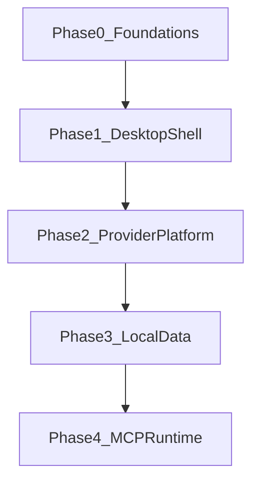

# Foundation Contracts

This document captures the Phase 0 outputs that Phase 1 depends on: repo topology, MVP boundary, and the cross-phase contract.

## Repo Topology

```text
apps/
  desktop/
crates/
  provider-core/
  mcp-runtime/
packages/
  config-schema/
  ui/
docs/
  adr/
  architecture/
  schemas/
  plans/
```

## MVP Boundary

Include:
- Desktop shell with routing and placeholder panels.
- Rust-owned trust boundary.
- Typed IPC surface and per-request streaming.
- Keychain-backed credential handling.
- Local settings persistence and diagnostics export.

Exclude:
- Real provider adapters.
- Full local database schema.
- Cloud sign-in and tenant administration.
- Broad MCP execution beyond the future contract.
- Code execution, memory, and skills.

## Cross-Phase Dependency Map



## Delivery Constraints

- The renderer presents state and intent only.
- Rust owns secrets, persistence, and privileged operations.
- Per-request channels are the streaming primitive, not a global event bus.
- Runtime branding is a config problem, not a code fork.
